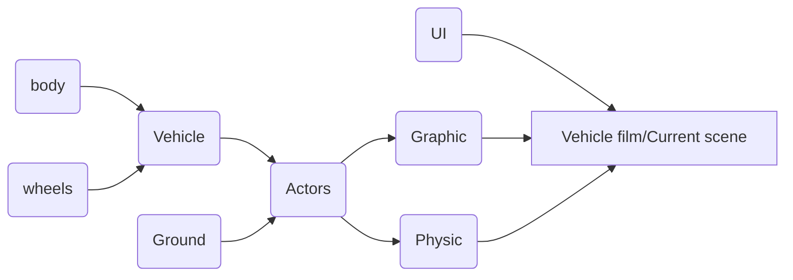


# Physic vehicle simulation 

Приложение по управлению ТС отображающее базовые физические и визуальные свойства автомобиля. В качестве физического движка используется [Cannon.js](https://schteppe.github.io/cannon.js/), для графики - [Three.js](https://threejs.org/) . 
Мир представлен неровной поверхностью и свободно управляемым автомобилем. Редактирование свойств физического мира, сцены и автомобиля доступно в UI. 

## Recommendations: 
- Используйте настройки сцены для: изменения окружения (on/off fog mode and change fog and background color using "background"); изменения настроек освещения сцены.
- Для комфортной езды в настройках сцены задайте параметры "cameraMaxDist" = 3; "cameraMaxAngle" = 1.09 (for example). Далее в зависимости от желаемого Вами режима просмотра (driving, vehicle view etc. ) изменяйте данные параметры на Ваше усмотрение.
- В настройках физического мира ("World") есть возможность поиграться с гравитацией; управлять режимами работы как графического "stopAnimation" так и физического движка "pausePhysic"; менять частоту работы физического мира (по умолчанию 1/60 как и графика).
- Настройки автомобиля дают возможность управлять: максимальной силой тяги на колесах "maxEngineForce"; максимальным тормозным усилием "maxBreakForce"; трением между колесом и поверхностью "friction"; выбрать тип привода. Так же доступны настройки фар, подвески и материалов в соответствующих разделах. 

## Functions:
1. Object controls (WASD);
2. Space - handbrake;
3. B - set/reset handbrake;
4. E - turn on/off cruise control (Activate speed control where "W" - add, "S" - subtract speed;
5. F - fix/unfix current steering angle; 
6. L - turn on/off headlights;
7. R - reset vehicle;
8. V - visible/invisible ui

# Demo 
 - [Live application](https://physic-vehicle-model.herokuapp.com/) 

# Usage 
From root project install modules:

    npm run install
    
To run dev server use: 

    npm run start

# Structure 
Application flow chart:

# Docs 

- [Three.js](https://threejs.org/) 
- [Cannon.js](https://schteppe.github.io/cannon.js/)

